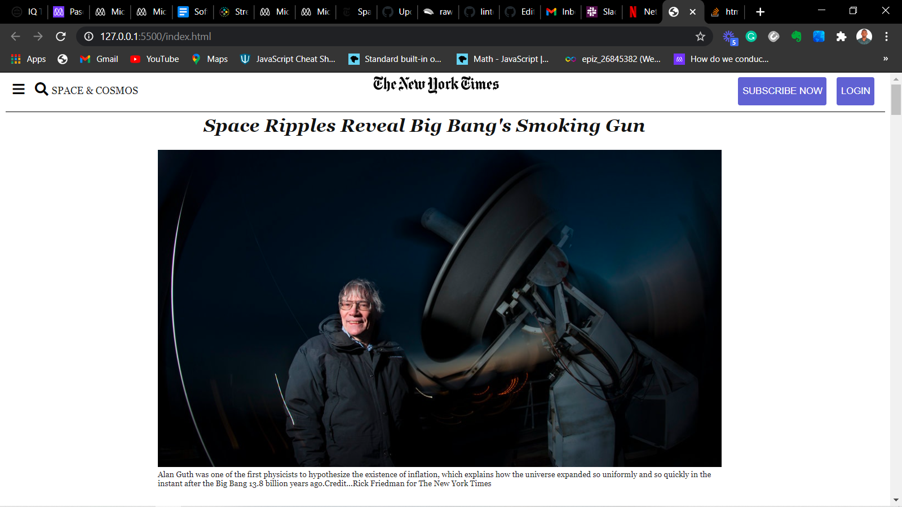

# positioning-and-floating-elements-project1

> Clone of the New York Times using float positioning technique
> This is a project that clones the New York Time Website. The purpose of this project is to practice with positioning and floating.

 Clone of an article page from [The New York Times](https://www.nytimes.com/2014)
## Built With

- Html,
- CSS
- CSS,
- Linter,
- Vs code

## Live Demo

[Live Demo Link](https://rawcdn.githack.com/Byabasaija/positioning-and-floating-elements-project1/1109864879ad586ef56a9cc8aea53e6f4aab43b2/index.html)

## Automated Test
> There are no automated tests for this project yet.

## Authors

 wandji20   
 
  
 Byabashaija

 Contributions, issues and feature requests are welcome! Start by:
* Push your branch up to your forked repository
* Open a Pull Request with a detailed description to the development branch of the original project for a review

## Show your support
Give a :star: if you like this project!

